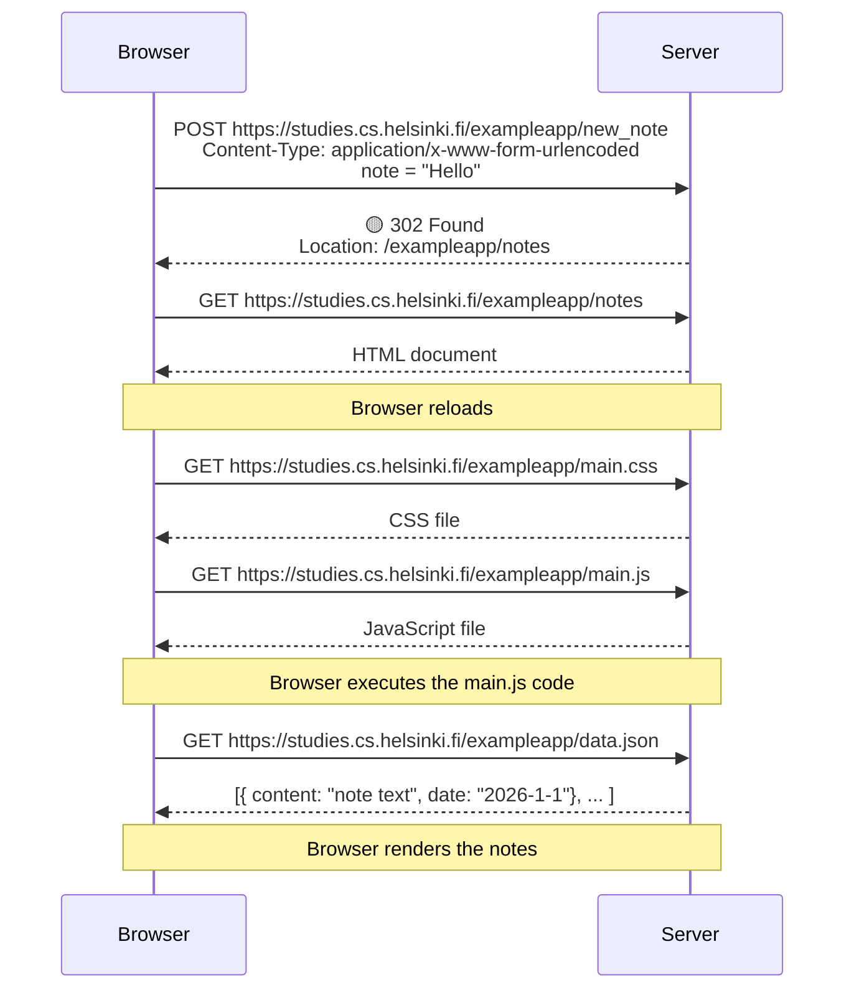

```mermaid
sequenceDiagram
    participant Browser
    participant Server

    Browser->>Server: POST https://studies.cs.helsinki.fi/exampleapp/new_note <br/> Content-Type: application/x-www-form-urlencoded <br/> note = "Hello"

    Server-->>Browser: 🟡 302 Found <br/> Location: /exampleapp/notes

    Browser->>Server: GET https://studies.cs.helsinki.fi/exampleapp/notes

    Server-->>Browser: HTML document
    Note over Browser,Server: Browser reloads

    Browser->>Server: GET https://studies.cs.helsinki.fi/exampleapp/main.css
    
    Server-->>Browser: CSS file

    Browser->>Server: GET https://studies.cs.helsinki.fi/exampleapp/main.js

    Server-->>Browser: JavaScript file
    Note over Browser,Server: Browser executes the main.js code

    Browser->>Server: GET https://studies.cs.helsinki.fi/exampleapp/data.json

    Server-->>Browser: [{ content: "note text", date: "2026-1-1"}, ... ]
    Note over Browser,Server: Browser renders the notes
```
