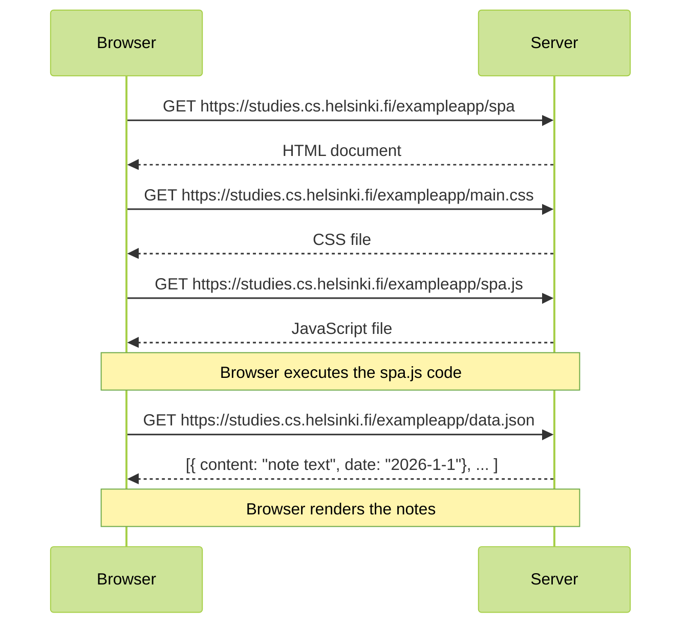

```mermaid
---
config:
    theme: forest
---
sequenceDiagram
    participant Browser
    participant Server

    Browser->>Server: GET https://studies.cs.helsinki.fi/exampleapp/spa
    
    Server-->>Browser: HTML document

    Browser->>Server: GET https://studies.cs.helsinki.fi/exampleapp/main.css
    
    Server-->>Browser: CSS file

    Browser->>Server: GET https://studies.cs.helsinki.fi/exampleapp/spa.js

    Server-->>Browser: JavaScript file
     Note over Browser,Server: Browser executes the spa.js code

    Browser->>Server: GET https://studies.cs.helsinki.fi/exampleapp/data.json

    Server-->>Browser: [{ content: "note text", date: "2026-1-1"}, ... ]
    Note over Browser,Server: Browser renders the notes
```