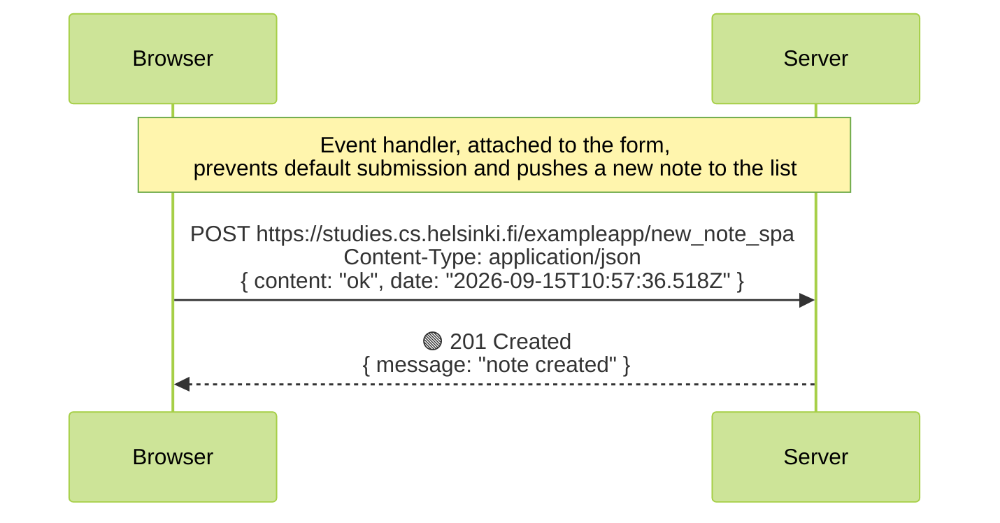

```mermaid
---
config:
    theme: forest
    themeVariables:
        background: "#ffffff"
---
sequenceDiagram
    participant Browser
    participant Server

    Note over Browser,Server: Event handler, attached to the form,<br/> prevents default submission and pushes a new note to the list
    Browser->>Server: POST https://studies.cs.helsinki.fi/exampleapp/new_note_spa <br/> Content-Type: application/json <br/> { content: "ok", date: "2026-09-15T10:57:36.518Z" }

    Server-->>Browser: 🟢 201 Created <br/> { message: "note created" }
```